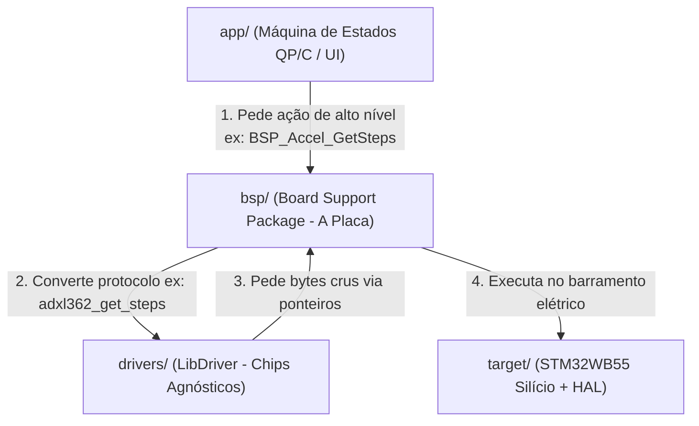

# 🧠 Guia Definitivo de Arquitetura: BSP, LibDriver e Estrutura de Pastas

> **Projeto:** `ao_watch` (Smartwatch STM32WB55)  
> **Objetivo:** Estabelecer as fronteiras arquiteturais definitivas entre Silício, Drivers de Chips (LibDriver), Suporte de Placa (BSP) e Máquinas de Estado (QP/C).

---

## 📑 Sumário
1. [A Fronteira dos 4 Mundos (A Linha Divisória)](#1-a-fronteira-dos-4-mundos-a-linha-divisória)
2. [O que Realmente vai no BSP?](#2-o-que-realmente-vai-no-bsp)
3. [LibDriver vs. BSP: Amigos ou Inimigos?](#3-libdriver-vs-bsp-amigos-ou-inimigos)
4. [Exemplo Prático de Código (Passo a Passo)](#4-exemplo-prático-de-código-passo-a-passo)
5. [A Estrutura de Pastas Padrão Ouro](#5-a-estrutura-de-pastas-padrão-ouro)
6. [O Fator Wearable: Baixo Consumo e Armadilhas de Hardware](#6-o-fator-wearable-baixo-consumo-e-armadilhas-de-hardware)
7. [Checklist de Refatoração Imediata](#7-checklist-de-refatoração-imediata)

---

## 1. A Fronteira dos 4 Mundos (A Linha Divisória)

Para nunca mais confundir onde colocar cada arquivo, memorize esta tabela de responsabilidades:

| Camada | Pasta | O que ela SABE? | O que ela NUNCA deve saber? |
| :--- | :--- | :--- | :--- |
| **1. Silício (Target)** | `target/` | Como ligar a energia, clocks e periféricos (SPI, I2C, RTC, DMA) do chip STM32. | Não sabe o que está conectado na ponta do pino (se é tela, acelerômetro ou motor). |
| **2. Chip Externo (Driver)** | `drivers/` | O mapa de registradores e o protocolo do chip (ex: ADXL362, MAX30102). | Não sabe qual microcontrolador está falando com ele (STM32, ESP32, Arduino). |
| **3. A Placa (BSP)** | `bsp/` | **É o casamento!** Sabe que o sensor X está no SPI2 com o Chip Select no pino PA1 da placa. | Não sabe regras de negócio do relógio (se é alarme, cronômetro ou UI). |
| **4. Aplicação (App)** | `app/` | Regras do relógio (HSM QP/C, menus, troca de telas, contagem de passos). | Nunca toca em registradores, HAL ou funções de SPI/I2C diretamente. |



---

## 2. O que Realmente vai no BSP?

Uma das maiores dúvidas é: *"Por que não fazemos `bsp_spi.c` e sim `bsp_accel.c`?"*

### A Regra de Ouro:
> **A aplicação interage com DISPOSITIVOS FÍSICOS da placa, e não com barramentos abstratos.**

* ❌ **Errado (Baixo nível na aplicação):** A aplicação chamar `bsp_spi_write(0x2C, buffer, 2)`. Quem é `0x2C`? O que isso faz? Isso acopla a aplicação aos bits elétricos.
* ✅ **Correto (Abstração de Placa):** A aplicação chamar `BSP_Accel_GetSteps()`, `BSP_Display_Flush()` ou `BSP_Battery_GetMillivolts()`.

### O que mora na pasta `bsp/`:
1. `bsp_board.h`: O "esquema elétrico em código" (mapeamento de todos os pinos `GPIO_PIN_x` da placa).
2. `bsp_display.c / .h`: Inicializa a tela da placa, gerencia o buffer e dispara transferências via DMA.
3. `bsp_accel.c / .h`: Inicializa o acelerômetro, amarra as funções de leitura SPI e entrega dados tratados.
4. `bsp_buttons.c / .h`: Lê os pinos dos botões físicos, faz debounce e emite eventos para o sistema.
5. `bsp_battery.c / .h`: Lê o canal ADC conectado ao divisor de tensão da bateria.

---

## 3. LibDriver vs. BSP: Amigos ou Inimigos?

O ecossistema **LibDriver** (criado por Shifeng Li) é excelente para não reinventar a roda lendo centenas de páginas de datasheets. Ele e o conceito de BSP **não se contradizem; eles se completam**.

### Como o LibDriver é construído:
Cada sensor do LibDriver possui 3 partes:
1. `driver_<sensor>.c / .h`: **Core Puro.** Contém todas as funções de protocolo e registradores. Utiliza ponteiros de função para comunicação (`Dependency Injection`).
2. `driver_<sensor>_interface.c / .h`: **Camada de Porting.** Onde o usuário escreve a ponte com o hardware do microcontrolador.
3. `driver_<sensor>_basic.c / .h`: **Fachada (Facade).** Exemplos de inicialização simplificada.

### O Padrão Ideal: "Thick BSP" (Absorvendo o LibDriver)
Para manter o projeto limpo e sem centenas de arquivos repetitivos:
* Deixe na pasta `drivers/<sensor>/` **apenas** o `driver_<sensor>.c` e `driver_<sensor>.h`.
* O seu arquivo `bsp/src/bsp_<sensor>.c` **absorve** o que seria o `_interface.c` e o `_basic.c`.

---

## 4. Exemplo Prático de Código (Passo a Passo)

Veja como o acelerômetro **ADXL362** funciona de ponta a ponta:

### Passo 1: O Silício (`target/src/target_spi.c`)
Liga o periférico SPI do STM32. Não sabe que existe um acelerômetro no mundo.
```c
#include "target_spi.h"
#include "stm32wbxx_hal.h"

SPI_HandleTypeDef hspi2;

void Target_SPI2_Init(void) {
    __HAL_RCC_SPI2_CLK_ENABLE();
    hspi2.Instance = SPI2;
    hspi2.Init.Mode = SPI_MODE_MASTER;
    hspi2.Init.BaudRatePrescaler = SPI_BAUDRATEPRESCALER_16;
    hspi2.Init.CLKPolarity = SPI_POLARITY_LOW;
    hspi2.Init.CLKPhase = SPI_PHASE_1EDGE;
    hspi2.Init.NSS = SPI_NSS_SOFT;
    HAL_SPI_Init(&hspi2);
}

bool Target_SPI2_Transfer(uint8_t *tx, uint8_t *rx, uint16_t len) {
    return HAL_SPI_TransmitReceive(&hspi2, tx, rx, len, 100) == HAL_OK;
}
```

---

### Passo 2: O Driver Agnóstico (`drivers/adxl362/driver_adxl362.c`)
Código do LibDriver intacto. Não inclui headers de microcontroladores.
```c
// driver_adxl362.c
#include "driver_adxl362.h"

uint8_t adxl362_read_reg(adxl362_handle_t *handle, uint8_t reg, uint8_t *buf, uint16_t len) {
    if (handle->spi_read == NULL) return 1;
    return handle->spi_read(reg, buf, len); // Chama o ponteiro!
}
```

---

### Passo 3: O BSP (`bsp/src/bsp_accel.c`) — O Casamento
O BSP implementa os callbacks para o LibDriver e expõe uma API humana para a Aplicação.
```c
#include "bsp_accel.h"
#include "bsp_board.h"
#include "driver_adxl362.h"
#include "target_spi.h"

static adxl362_handle_t g_accel_handle;

// 1. Ponte de hardware que o LibDriver vai chamar
static uint8_t cb_spi_read(uint8_t reg, uint8_t *buf, uint16_t len) {
    HAL_GPIO_WritePin(ACCEL_CS_PORT, ACCEL_CS_PIN, GPIO_PIN_RESET);
    Target_SPI2_Transfer(&reg, NULL, 1);
    Target_SPI2_Transfer(NULL, buf, len);
    HAL_GPIO_WritePin(ACCEL_CS_PORT, ACCEL_CS_PIN, GPIO_PIN_SET);
    return 0;
}

// 2. Inicialização exposta para a aplicação
bool BSP_Accel_Init(void) {
    DRIVER_ADXL362_LINK_INIT(&g_accel_handle, adxl362_handle_t);
    DRIVER_ADXL362_LINK_SPI_READ(&g_accel_handle, cb_spi_read);
    
    if (adxl362_init(&g_accel_handle) != 0) return false;
    adxl362_set_measurement_mode(&g_accel_handle, ADXL362_MODE_MEASUREMENT);
    return true;
}

// 3. Leitura simplificada exposta para o Smartwatch
uint32_t BSP_Accel_GetSteps(void) {
    uint32_t steps = 0;
    adxl362_get_step_counter(&g_accel_handle, &steps);
    return steps;
}
```

---

### Passo 4: A Aplicação / HSM QP/C (`app/model/ao_watch.c`)
A máquina de estados fica 100% livre de detalhes elétricos.
```c
// Dentro de uma ação da HSM do relógio:
case TICK_SIG: {
    uint32_t steps = BSP_Accel_GetSteps();
    UI_UpdateStepsCount(steps); // Atualiza a tela
    status_ = Q_HANDLED();
    break;
}
```

---

## 5. A Estrutura de Pastas Padrão Ouro

```text
ao_watch/
├── cmake/                      # Toolchains e opções do CMake
│   ├── toolchains/
│   │   └── arm-none-eabi.cmake
│   └── mcu/
│       └── stm32wb55.cmake
│
├── target/                     # 1. SILÍCIO: Código do STM32WB55 puro
│   ├── startup/
│   │   └── startup_stm32wb55xx_cm4.s
│   ├── linker/
│   │   └── stm32wb55xx_flash_cm4.ld
│   ├── inc/
│   │   ├── target_clock.h      # MSI, HSE (32MHz), LSE (32.768kHz)
│   │   ├── target_gpio.h
│   │   ├── target_spi.h        # SPI1 (Display), SPI2 (Sensores)
│   │   ├── target_i2c.h
│   │   ├── target_rtc.h
│   │   └── target_power.h      # Sleep, Stop 2 e Standby
│   └── src/
│       ├── target_clock.c
│       ├── target_spi.c
│       ├── target_rtc.c
│       └── target_it.c         # SysTick e ISRs
│
├── bsp/                        # 2. PLACA: Board Support Package
│   ├── inc/
│   │   ├── bsp_board.h         # Mapeamento oficial de pinos da placa
│   │   ├── bsp_display.h       # Interface de desenho
│   │   ├── bsp_buttons.h       # Debounce e leitura física
│   │   ├── bsp_accel.h         # Fachada do acelerômetro
│   │   └── bsp_battery.h       # Monitoramento de bateria
│   └── src/
│       ├── bsp_display_sharp.c # SPI1 + DMA + LPTIM1 EXTCOM
│       ├── bsp_buttons.c
│       └── bsp_accel.c
│
├── drivers/                    # 3. CHIPS: LibDriver agnóstico (C puro)
│   ├── adxl362/
│   │   ├── driver_adxl362.c
│   │   └── driver_adxl362.h
│   ├── max30102/
│   │   ├── driver_max30102.c
│   │   └── driver_max30102.h
│   └── ls013b7dh03/
│       ├── driver_ls013b7dh03.c
│       └── driver_ls013b7dh03.h
│
├── third_party/                # 4. DEPENDÊNCIAS EXTERNAS INTACTAS
│   ├── stm32cube_wb/           # HAL e CMSIS oficiais da ST
│   └── qpc/                    # Framework QP/C (Active Objects)
│
├── app/                        # 5. CÉREBRO: Aplicação e Máquinas de Estado
│   ├── model/                  # Arquivo do QM Tool gerando código AQUI
│   │   ├── watch.qm
│   │   ├── ao_watch.c          # Active Object de controle das telas
│   │   ├── ao_watch.h
│   │   ├── ao_sensors.c        # Active Object de amostragem periódica
│   │   └── ao_sensors.h
│   ├── ui/                     # Layouts, telas e fontes
│   │   ├── ui_manager.c
│   │   └── ui_manager.h
│   ├── inc/
│   │   ├── qp_config.h         # Configuração dos timers e filas do QP/C
│   │   └── app_events.h        # Sinais (ENTER_SIG, MODE_SIG, TICK_SIG)
│   └── main.c                  # Ponto de entrada: Inicia BSP, AOs e dá QF_run()
│
├── tools/                      # APENAS Scripts e utilitários de bancada
│   ├── get_mcu.sh
│   ├── flash.sh
│   └── svd/
│       └── STM32WB55_CM4.svd
│
└── docs/                       # Datasheets e manuais
```

---

## 6. O Fator Wearable: Baixo Consumo e Armadilhas de Hardware

1. **Suspensão de CPU no `QV_onIdle`**:
   Em `main.c`, o hook ocioso do QP/C **deve** colocar o chip para dormir:
   ```c
   void QV_onIdle(void) {
       __WFI(); // Wait For Interrupt: economiza até 90% de bateria
   }
   ```
2. **Cristal LSE de 32.768 kHz Obrigatório**:
   O RTC e o LPTIM1 devem rodar pelo cristal externo LSE. Isso permite que o relógio mantenha a hora e oscile a tela Sharp mesmo em modo **Stop 2** ($\approx 2 \mu\text{A}$).
3. **Sinal `EXTCOM` do Display Sharp LS013B7DH03**:
   A tela de memória exige uma inversão de sinal periódico (1 Hz a 60 Hz) no pino `EXTCOM`. Use o `LPTIM1` configurado em PWM via LSE para fazer isso em hardware puro sem acordar a CPU.
4. **Nunca Sobrescrever o RTC no Boot**:
   Verifique se o RTC já estava inicializado antes de setar data/hora padrão:
   ```c
   if (__HAL_RCC_GET_FLAG(RCC_FLAG_BORRST) == RESET) {
       // Já estava rodando na bateria de backup, não reseta a hora!
   }
   ```

---

## 7. Checklist de Refatoração Imediata

- [ ] **Mover o QM Tool:** Abrir `tools/_watch.qm` no QM e alterar o target de geração de `./watch/src` para `../../app/model`.
- [ ] **Limpar o CMakeLists.txt:** Remover o caminho `tools/watch/src` e adicionar `app/model` e `app/ui`.
- [ ] **Corrigir TARGET_MCU:** No `CMakePresets.json`, mudar `"TARGET_MCU": "STM32WBXX"` para `"STM32WB55xx"`.
- [ ] **Desacoplar a HSM:** Remover chamadas diretas como `bsp_display_write_string_ssd1306()` de dentro de `HSM.c`.
- [ ] **Consertar colisão de pinos:** Em `board_config.h`, garantir que `DISP_CS_PIN` e `DISP_EXTCOM_PIN` estejam em pinos diferentes.
