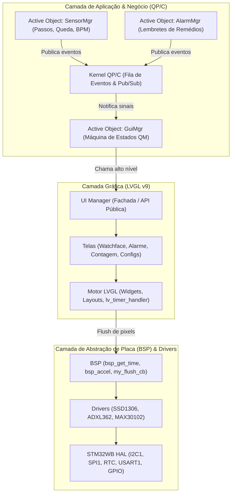

# Arquitetura de Software: Smartwatch STM32WB55 (LVGL v9 + QP/C + BSP)

Este documento descreve a arquitetura do firmware do smartwatch baseado no microcontrolador **STM32WB55**, detalhando o histórico de otimizações, a solução do display OLED SSD1306 e o padrão de integração entre a biblioteca gráfica **LVGL v9** e o framework de objetos ativos orientados a eventos **QP/C**.

---

## 1. Histórico de Otimizações e Correções

### 1.1 Otimização do Tempo de Build (8 minutos $\to$ 10 segundos)
- **Problema:** O CMake recompilava todo o código-fonte do LVGL a cada build incremental.
- **Solução:**
  - O LVGL foi isolado em uma biblioteca estática dedicada (`liblvgl.a`).
  - Fontes CJK e drivers de GPU não utilizados (NemaGFX, VG-Lite, DAVE2D) foram excluídos da compilação.
  - O overhead de verificação de cabeçalhos foi removido no `CMakeLists.txt`.

### 1.2 Otimização de Memória Flash e RAM
- **Flash:** Reduzida de **60.96% (319 KB)** para **~25% (131 KB)**.
- **RAM:** Reduzida de **25.00%** para **12.67% (24.9 KB)**.
- **Ações:** Remoção de backends de desenho não utilizados (`RGB565`, `ARGB8888`), compressões pesadas e fontes redundantes no `lv_conf.h`.

### 1.3 Correção Crítica do Display SSD1306 (Tela Apagada)
1. **Gargalo I2C:** A função `ssd1306_basic_write_point()` executava 4 comandos I2C síncronos por pixel. Em uma tela de $128 \times 64 = 8.192$ pixels, isso gerava **32.768 transações I2C por frame**, travando a CPU e o barramento.
   - **Solução:** Implementação das funções `ssd1306_basic_gram_write_point()` (escrita direta em RAM em microssegundos) e `ssd1306_basic_gram_update()` (envio de apenas 8 transmissões em bloco, 1 por página, durando ~20ms a 400kHz).
2. **Backend L8 Desativado no LVGL:** O `lv_conf.h` estava com `#define LV_DRAW_SW_SUPPORT_L8 0`. Com isso, todas as funções de renderização do LVGL para o formato de cor `LV_COLOR_FORMAT_L8` eram ignoradas em tempo de compilação, gerando um buffer vazio.
   - **Solução:** Ativado `#define LV_DRAW_SW_SUPPORT_L8 1`.
3. **Polaridade do Tema Monocromático:** Inicializado com `lv_theme_mono_init(disp, true, LV_FONT_DEFAULT)` (`dark_bg = true`), garantindo fundo desligado (preto) e pixels ativos acesos (branco).

---

## 2. Visão Geral da Arquitetura em Camadas



### Regras de Separação de Responsabilidades:
1. **O LVGL não acessa hardware:** Telas e widgets nunca chamam funções do HAL ou I2C diretamente.
2. **O QP/C não manipula coordenadas de pixel:** O `GuiMgr` não calcula posições `(x, y)` de textos ou ícones. Ele apenas diz *"Abra a tela X"* ou *"A hora atual é 12:00:00"*.
3. **O `ui_manager` é a ponte:** Atua como fachada entre o QP/C e o LVGL.

---

## 3. Estrutura de Diretórios Recomendada

```text
watch/
├── core/                       # Boot do microcontrolador e inicializações HAL
│   ├── inc/
│   └── src/
│       ├── main.c              # Inicializa hardware, LVGL, QP/C e roda QF_run()
│       ├── i2c.c, rtc.c, ...
├── lib/
│   ├── bsp/                    # Hardware específico da placa (sem regras de negócio)
│   │   ├── inc/board_config.h, bsp.h
│   │   └── src/bsp.c
│   ├── components/             # Drivers dos chips (ssd1306, adxl362, max30102)
│   └── third_party/            # Bibliotecas externas (lvgl, qpc)
│
└── app/                        # Regras de Negócio do Smartwatch
    ├── inc/
    │   ├── app.h               # Sinais globais do QP/C (TICK_SIG, MODE_SIG, etc.)
    │   └── app_events.h        # Estruturas com dados dos eventos
    ├── active_objects/         # Objetos Ativos (gerados pelo QM ou manuais)
    │   ├── gui.c               # Máquina de estados do GuiMgr
    │   ├── alarm_mgr.c         # Gerenciamento de alarmes de remédio
    │   └── health_mgr.c        # Monitoramento de sensores de saúde
    └── ui/                     # Telas e Interface Gráfica LVGL
        ├── ui_manager.h        # Header da API exposta para o GuiMgr
        ├── ui_manager.c        # Gerenciamento de inicialização e transições
        └── screens/
            ├── screen_watchface.c  # Mostrador principal
            ├── screen_countdown.c  # Temporizador / cronômetro
            └── screen_alarm.c      # Pop-up de alarme de remédio
```

---

## 4. Implementação Passo a Passo

### 4.1 A Tela no LVGL (`app/ui/screens/screen_watchface.c`)
Responsável exclusivamente por alinhamentos, fontes e criação de widgets:

```c
#include "lvgl.h"
#include "ui_manager.h"

static lv_obj_t *lbl_time;
static lv_obj_t *lbl_batt;
static lv_obj_t *badge_box;

void screen_watchface_create(void) {
    // 1. Limpa elementos da tela anterior
    lv_obj_clean(lv_screen_active());

    // 2. Relógio no canto superior esquerdo
    lbl_time = lv_label_create(lv_screen_active());
    lv_label_set_text(lbl_time, "--:--:--");
    lv_obj_align(lbl_time, LV_ALIGN_TOP_LEFT, 2, 0);

    // 3. Indicador de bateria no canto superior direito
    lbl_batt = lv_label_create(lv_screen_active());
    lv_label_set_text(lbl_batt, "100% " LV_SYMBOL_BATTERY_FULL);
    lv_obj_align(lbl_batt, LV_ALIGN_TOP_RIGHT, -2, 0);

    // 4. Badge centralizado
    badge_box = lv_obj_create(lv_screen_active());
    lv_obj_set_size(badge_box, 48, 18);
    lv_obj_center(badge_box);
    lv_obj_set_scrollbar_mode(badge_box, LV_SCROLLBAR_MODE_OFF);

    lv_obj_t *badge_lbl = lv_label_create(badge_box);
    lv_label_set_text(badge_lbl, "WATCH");
    lv_obj_center(badge_lbl);
}

void screen_watchface_update_time(uint8_t h, uint8_t m, uint8_t s) {
    if (lbl_time) {
        char buf[16];
        lv_snprintf(buf, sizeof(buf), "%02u:%02u:%02u", h, m, s);
        lv_label_set_text(lbl_time, buf);
    }
}

void screen_watchface_update_battery(uint8_t pct) {
    if (lbl_batt) {
        const char *icon = (pct > 75) ? LV_SYMBOL_BATTERY_FULL :
                           (pct > 50) ? LV_SYMBOL_BATTERY_3 :
                           (pct > 25) ? LV_SYMBOL_BATTERY_2 :
                           (pct > 10) ? LV_SYMBOL_BATTERY_1 : LV_SYMBOL_BATTERY_EMPTY;
        char buf[16];
        lv_snprintf(buf, sizeof(buf), "%u%% %s", pct, icon);
        lv_label_set_text(lbl_batt, buf);
    }
}
```

---

### 4.2 O Gerenciador de Interface (`app/ui/ui_manager.h` e `ui_manager.c`)
Interface simplificada para os Active Objects chamarem:

```c
// app/ui/ui_manager.h
#ifndef UI_MANAGER_H
#define UI_MANAGER_H

#include <stdint.h>

void ui_init(void);

// Funções de Troca de Tela
void ui_show_watchface(void);
void ui_show_countdown(void);
void ui_show_alarm_modal(const char *med_name);

// Funções de Atualização de Dados
void ui_watchface_set_time(uint8_t h, uint8_t m, uint8_t s);
void ui_set_battery(uint8_t percentage);

#endif // UI_MANAGER_H
```

```c
// app/ui/ui_manager.c
#include "ui_manager.h"
#include "lvgl.h"

extern void screen_watchface_create(void);
extern void screen_watchface_update_time(uint8_t h, uint8_t m, uint8_t s);
extern void screen_watchface_update_battery(uint8_t pct);

void ui_init(void) {
    // Inicialização global de estilos, se necessária
}

void ui_show_watchface(void) {
    screen_watchface_create();
}

void ui_watchface_set_time(uint8_t h, uint8_t m, uint8_t s) {
    screen_watchface_update_time(h, m, s);
}

void ui_set_battery(uint8_t percentage) {
    screen_watchface_update_battery(percentage);
}
```

---

### 4.3 O Active Object no QP/C (`app/active_objects/gui.c`)
A máquina de estados apenas reage aos eventos e dispara chamadas na UI:

```c
#include "qpc.h"
#include "bsp.h"
#include "app.h"
#include "ui_manager.h" // <<< Apenas inclui o gerenciador de telas

static QState GuiMgr_timekeeping(GuiMgr * const me, QEvt const * const e) {
    QState status_;
    switch (e->sig) {
        
        // Ao entrar no estado:
        case Q_ENTRY_SIG: {
            QTimeEvt_armX(&me->timeEvt0, 1000U, 1000U); // Timer periódico de 1s
            ui_show_watchface(); // 1 chamada monta toda a interface!
            status_ = Q_HANDLED();
            break;
        }

        // Ao sair do estado:
        case Q_EXIT_SIG: {
            QTimeEvt_disarm(&me->timeEvt0);
            status_ = Q_HANDLED();
            break;
        }

        // Botão de alternar modo pressionado:
        case MODE_SIG: {
            status_ = Q_TRAN(&GuiMgr_countdown_FACE); // Transição para countdown
            break;
        }

        // Timer de 1 segundo disparou:
        case TICK_SIG: {
            bsp_datetime_t dt;
            bsp_get_time(&dt);
            ui_watchface_set_time(dt.hour, dt.minute, dt.second);
            status_ = Q_HANDLED();
            break;
        }

        // Notificação de bateria do sistema:
        case BATTERY_UPDATED_SIG: {
            BatteryEvt const *be = (BatteryEvt const *)e;
            ui_set_battery(be->percentage);
            status_ = Q_HANDLED();
            break;
        }

        default: {
            status_ = Q_SUPER(&GuiMgr_active);
            break;
        }
    }
    return status_;
}
```

---

### 4.4 Laço de Execução no Kernel Cooperativo QV (`core/src/main.c`)
No kernel cooperativo (QV), o processador despacha eventos dos Active Objects e roda o LVGL no tempo ocioso:

```c
void QV_onIdle(void) {
    // 1. Processa temporizadores internos e renderização do LVGL
    lv_timer_handler();

    // 2. Entra em modo de baixo consumo até o próximo evento/interrupção
    QV_CPU_SLEEP();
}

int main(void) {
    HAL_Init();
    QF_init();
    bsp_init(); 
    lv_init();   
    lv_tick_set_cb(HAL_GetTick);
    
    // Inicialização do display no LVGL
    lv_display_t *disp = lv_display_create(128, 64);
    lv_display_set_color_format(disp, LV_COLOR_FORMAT_L8);
    lv_display_set_buffers(disp, buf1, NULL, sizeof(buf1), LV_DISPLAY_RENDER_MODE_FULL);
    lv_display_set_flush_cb(disp, my_flush_cb);
    lv_theme_mono_init(disp, true, LV_FONT_DEFAULT);

    // Inicializa a UI
    ui_init();

    // Inicializa filas de eventos e Active Objects do QP/C
    GuiMgr_ctor();
    QActive_start(AO_GuiMgr, 1U, guimgr_queue, Q_DIM(guimgr_queue), NULL, 0U, NULL);

    AlarmMgr_ctor();
    QActive_start(AO_AlarmMgr, 2U, alarmmgr_queue, Q_DIM(alarmmgr_queue), NULL, 0U, NULL);

    // Inicia o framework (nunca retorna)
    return QF_run();
}
```

---

## 5. Vantagens Desta Arquitetura

1. **Facilidade de Manutenção Visual:** Para alterar layouts, cores, ícones ou textos, **apenas o arquivo da tela (`screen_*.c`) é modificado**. A máquina de estados do QM/QP/C permanece 100% inalterada.
2. **Segurança de Concorrência:** O LVGL não é thread-safe. Centralizando as mudanças de estado no Active Object `GuiMgr`, eliminam-se condições de corrida (`race conditions`).
3. **Portabilidade:** Se no futuro o display SSD1306 for substituído por outro hardware (ex: display colorido ST7789 ou e-Paper), apenas o driver e o `my_flush_cb` no BSP precisam ser adaptados; toda a lógica do QP/C e do LVGL permanece compatível.
